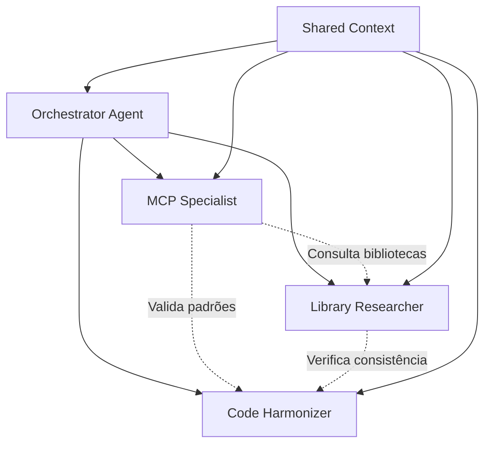

# Protocolo de Coordenação Context7 - Agentes MCP

## Visão Geral
Este documento define o protocolo de coordenação entre os 3 agentes especializados do Context7, garantindo harmonia e consistência na geração de código MCP.

---

## Arquitetura de Coordenação

### Hierarquia de Agentes


### Fluxo de Comunicação
1. **Orchestrator** recebe requisição e decompõe em tarefas
2. **Library Researcher** identifica bibliotecas e dependências
3. **MCP Specialist** implementa funcionalidades MCP
4. **Code Harmonizer** valida consistência e aplica padrões
5. **Orchestrator** consolida resultados e entrega resposta

---

## Protocolo de Mensagens

### Formato de Mensagem Padrão
```json
{
  "id": "uuid-v4",
  "timestamp": "ISO8601",
  "sender": "agent_name",
  "receiver": "agent_name|broadcast",
  "type": "task_request|status_update|result|error|query",
  "priority": "high|medium|low",
  "payload": {
    "task_id": "string",
    "action": "string",
    "data": "object",
    "context": "object",
    "dependencies": ["task_ids"],
    "validation_rules": ["rules"]
  },
  "metadata": {
    "correlation_id": "string",
    "retry_count": 0,
    "timeout": 300
  }
}
```

### Tipos de Mensagem

#### Task Request
```json
{
  "type": "task_request",
  "payload": {
    "action": "implement_mcp_server|research_libraries|harmonize_code",
    "requirements": "detailed_requirements",
    "constraints": "limitations_and_rules",
    "expected_output": "format_and_structure"
  }
}
```

#### Status Update
```json
{
  "type": "status_update",
  "payload": {
    "task_id": "uuid",
    "status": "started|in_progress|blocked|completed|failed",
    "progress": 0.75,
    "estimated_completion": "ISO8601",
    "blocking_issues": ["issue_descriptions"]
  }
}
```

#### Result
```json
{
  "type": "result",
  "payload": {
    "task_id": "uuid",
    "output": "generated_code|analysis_report|validation_results",
    "quality_metrics": {
      "coverage": 0.85,
      "complexity": 7,
      "compliance": 1.0
    },
    "next_actions": ["recommended_follow_ups"]
  }
}
```

---

## Contexto Compartilhado

### Estrutura do Contexto Global
```json
{
  "project": {
    "name": "context7-mcp",
    "version": "1.0.0",
    "description": "MCP Context7 Implementation",
    "target_languages": ["typescript", "python"],
    "frameworks": ["@modelcontextprotocol/sdk"]
  },
  "current_state": {
    "active_tasks": ["task_ids"],
    "completed_tasks": ["task_ids"],
    "blocked_tasks": ["task_ids"],
    "agent_status": {
      "orchestrator": "active",
      "mcp_specialist": "working",
      "library_researcher": "idle",
      "code_harmonizer": "reviewing"
    }
  },
  "standards": {
    "code_style": "biome_config",
    "naming_conventions": "camelCase_js_snake_case_py",
    "documentation": "jsdoc_docstrings",
    "testing": "jest_pytest"
  },
  "decisions": [
    {
      "id": "decision_001",
      "timestamp": "2025-01-28T14:00:00Z",
      "decision": "Use @modelcontextprotocol/sdk latest version",
      "rationale": "Official SDK with best compatibility",
      "impact": "All MCP implementations must use this SDK"
    }
  ],
  "conflicts": [
    {
      "id": "conflict_001",
      "timestamp": "2025-01-28T14:05:00Z",
      "description": "Naming convention conflict between agents",
      "status": "resolved",
      "resolution": "Follow TypeScript conventions for .ts files"
    }
  ]
}
```

### Sincronização de Contexto
- **Frequência**: A cada 30 segundos ou após mudanças significativas
- **Método**: Event-driven updates via message bus
- **Persistência**: JSON file em `workspace/shared_context/`
- **Conflict Resolution**: Last-write-wins com timestamp

---

## Regras de Coordenação

### 1. Precedência de Decisões
```yaml
precedence_order:
  1. security_requirements      # Nunca comprometer segurança
  2. mcp_protocol_compliance   # Seguir especificação MCP
  3. performance_requirements  # Manter performance aceitável
  4. code_consistency         # Manter padrões estabelecidos
  5. developer_experience     # Facilitar uso e manutenção
```

### 2. Resolução de Conflitos
```yaml
conflict_resolution:
  code_style:
    authority: "code_harmonizer"
    fallback: "biome_default_config"
    
  library_selection:
    authority: "library_researcher"
    validation: "mcp_specialist"
    fallback: "official_sdk_only"
    
  architecture_decisions:
    authority: "orchestrator"
    consultation: "all_agents"
    documentation: "required"
    
  performance_optimization:
    authority: "mcp_specialist"
    validation: "code_harmonizer"
    benchmarking: "required"
```

### 3. Validação Cruzada
```yaml
validation_matrix:
  mcp_specialist_output:
    reviewed_by: ["code_harmonizer"]
    validated_for: ["protocol_compliance", "code_standards"]
    
  library_researcher_recommendations:
    reviewed_by: ["mcp_specialist", "code_harmonizer"]
    validated_for: ["compatibility", "security", "maintenance"]
    
  code_harmonizer_changes:
    reviewed_by: ["mcp_specialist"]
    validated_for: ["functionality_preservation", "performance_impact"]
```

---

## Padrões de Trabalho

### 1. Decomposição de Tarefas
```yaml
task_decomposition:
  atomic_principle: "Uma tarefa = Um resultado testável"
  dependency_tracking: "Explicit dependency declaration"
  rollback_capability: "Each task must be reversible"
  
  standard_tasks:
    - name: "research_dependencies"
      owner: "library_researcher"
      inputs: ["requirements", "constraints"]
      outputs: ["dependency_list", "compatibility_matrix"]
      
    - name: "implement_mcp_feature"
      owner: "mcp_specialist"
      inputs: ["feature_spec", "dependencies"]
      outputs: ["implementation", "tests", "documentation"]
      
    - name: "harmonize_implementation"
      owner: "code_harmonizer"
      inputs: ["implementation", "style_guide"]
      outputs: ["harmonized_code", "style_report"]
```

### 2. Handover Protocol
```yaml
handover_requirements:
  documentation:
    - "What was implemented"
    - "How it was implemented"
    - "Why specific decisions were made"
    - "What remains to be done"
    
  code_quality:
    - "All tests passing"
    - "Linting compliance"
    - "Type checking passed"
    - "Security scan clean"
    
  context_update:
    - "Shared context updated"
    - "Dependencies documented"
    - "Breaking changes noted"
    - "Follow-up tasks created"
```

### 3. Qualidade Contínua
```yaml
quality_gates:
  per_commit:
    - "Biome linting: 100% compliance"
    - "TypeScript compilation: No errors"
    - "Unit tests: >85% coverage"
    - "Security scan: No high/critical issues"
    
  per_feature:
    - "Integration tests: All passing"
    - "Performance benchmarks: Within thresholds"
    - "Documentation: Complete and accurate"
    - "Cross-agent validation: Approved"
    
  per_release:
    - "End-to-end tests: All passing"
    - "Security audit: Complete"
    - "Performance testing: Acceptable"
    - "Documentation review: Complete"
```

---

## Métricas e Monitoramento

### 1. Métricas de Coordenação
```yaml
coordination_metrics:
  communication_efficiency:
    - "Average message response time"
    - "Message retry rate"
    - "Conflict resolution time"
    
  task_execution:
    - "Task completion rate"
    - "Average task duration"
    - "Dependency resolution time"
    - "Rollback frequency"
    
  quality_metrics:
    - "Code consistency score"
    - "Cross-validation pass rate"
    - "Rework frequency"
    - "Bug introduction rate"
```

### 2. Alertas e Escalações
```yaml
alerting_rules:
  high_priority:
    - "Agent unresponsive >2 minutes"
    - "Task failure rate >20%"
    - "Security violation detected"
    - "Context sync failure"
    
  medium_priority:
    - "Task queue backup >10 items"
    - "Quality gate failure"
    - "Performance degradation >50%"
    - "Dependency conflict detected"
    
  escalation_policy:
    - "Immediate: Security issues"
    - "15 minutes: High priority"
    - "1 hour: Medium priority"
    - "Daily: Low priority trends"
```

---

## Comandos de Coordenação

### 1. Comandos do Orchestrator
```bash
# Iniciar coordenação de tarefa
/coordinate task --type="mcp_implementation" --priority="high"

# Status de todos os agentes
/status --all

# Resolver conflito
/resolve-conflict --id="conflict_001" --strategy="vote"

# Sincronizar contexto
/sync-context --force
```

### 2. Comandos Inter-Agentes
```bash
# Consultar especialista
/query agent:library_researcher --question="Latest MCP SDK version?"

# Solicitar validação
/validate code --by="code_harmonizer" --type="style_compliance"

# Compartilhar resultado
/share result --task="task_001" --broadcast

# Bloquear/Desbloquear recurso
/lock resource --path="src/server.ts" --duration="300s"
/unlock resource --path="src/server.ts"
```

---

## Implementação do Protocolo

### 1. Event Bus Implementation
```typescript
export class Context7EventBus {
  private subscribers = new Map<string, Function[]>();
  
  subscribe(event: string, handler: Function): void {
    if (!this.subscribers.has(event)) {
      this.subscribers.set(event, []);
    }
    this.subscribers.get(event)!.push(handler);
  }
  
  publish(event: string, data: any): void {
    const handlers = this.subscribers.get(event) || [];
    handlers.forEach(handler => handler(data));
  }
  
  // Implementar persistence, retry logic, etc.
}
```

### 2. Context Manager
```typescript
export class Context7ContextManager {
  private context: SharedContext;
  private syncInterval: NodeJS.Timeout;
  
  constructor() {
    this.loadContext();
    this.startSync();
  }
  
  private loadContext(): void {
    // Load from shared_context.json
  }
  
  private startSync(): void {
    this.syncInterval = setInterval(() => {
      this.syncWithFile();
    }, 30000);
  }
  
  updateContext(updates: Partial<SharedContext>): void {
    // Merge updates with conflict resolution
    // Persist changes
    // Notify other agents
  }
}
```

Este protocolo garante que os 3 agentes trabalhem em harmonia, mantendo consistência, qualidade e eficiência na geração de código MCP Context7.